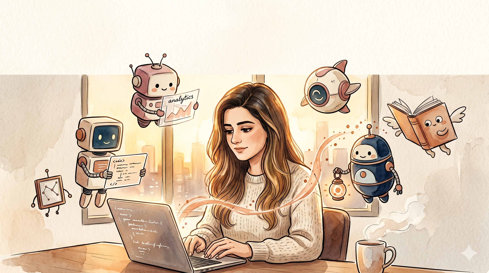

```{=html}
<section class="hero-stage" id="hero-stage">
  

  <div class="hero-gradient-top"></div>

  <div class="particle-layer" aria-hidden="true"></div>

  <div class="wisp-layer" aria-hidden="true">
    <svg viewBox="0 0 300 300" preserveAspectRatio="none">
      <defs>
        <filter id="wispBlur" x="-50%" y="-50%" width="200%" height="200%">
          <feGaussianBlur in="SourceGraphic" stdDeviation="2.5" />
        </filter>
      </defs>
      <path class="wisp-path" d="M60 290 C 90 240, 40 200, 110 150 S 180 80, 140 20" />
      <path class="wisp-path" d="M150 295 C 170 230, 130 180, 200 130 S 240 60, 200 10" />
      <path class="wisp-path" d="M230 290 C 250 240, 210 200, 260 150 S 280 80, 250 30" />
    </svg>
  </div>

  <nav class="landing-nav warm-glass" aria-label="Primary">
    <a class="nav-logo" href="/">Merna Saad</a>
    <ul class="nav-links">
      <li><a href="/projects/">Projects</a></li>
      <li><a href="/about-me/">About</a></li>
      <li><a href="/resume/">Resume</a></li>
      <li><a href="/fun/">Fun</a></li>
    </ul>
  </nav>

  <div class="hero-content">
    <h1 class="hero-heading">Merna Saad</h1>
    <p class="hero-subtitle-1">I build things with data.</p>
    <p class="hero-subtitle-2">MSBA at UCSD Rady.</p>
    <div class="hero-buttons">
      <a class="hero-btn primary warm-glass" href="/projects/">
        <span>See my work</span>
        <span class="arrow" aria-hidden="true">&rarr;</span>
      </a>
      <a class="hero-btn secondary warm-glass" href="/about-me/">
        <span>My story</span>
      </a>
    </div>
  </div>

  <div class="scroll-indicator" aria-hidden="true">
    <svg class="chev" viewBox="0 0 24 24" fill="none" stroke="currentColor" stroke-width="1.6" stroke-linecap="round" stroke-linejoin="round">
      <polyline points="6 9 12 15 18 9"></polyline>
    </svg>
    <span class="scroll-label">scroll</span>
  </div>
</section>

<div class="hero-spacer" style="height:70vh; width:100%; background: linear-gradient(to bottom, rgba(245,239,230,0) 0%, #F5EFE6 35%); position: relative; z-index: 0;"></div>
```

```{=html}
<script src="https://cdnjs.cloudflare.com/ajax/libs/gsap/3.12.5/gsap.min.js"></script>
<script src="https://cdnjs.cloudflare.com/ajax/libs/gsap/3.12.5/ScrollTrigger.min.js"></script>
```

```{=html}
<script>
(function generateParticles() {
  function ready(fn){
    if (document.readyState !== 'loading') fn();
    else document.addEventListener('DOMContentLoaded', fn);
  }
  ready(function(){
    var layer = document.querySelector('.particle-layer');
    if (!layer) return;
    var count = 30;
    for (var i = 0; i < count; i++) {
      var p = document.createElement('div');
      p.className = 'particle';
      var size = Math.random() * 4 + 2;
      p.style.width = size + 'px';
      p.style.height = size + 'px';
      p.style.left = (Math.random() * 100) + 'vw';
      p.style.bottom = '-10px';
      p.style.animationDuration = (Math.random() * 10 + 15) + 's';
      p.style.animationDelay = (Math.random() * 15) + 's';
      var peak = (Math.random() * 0.5 + 0.3).toFixed(2);
      p.style.setProperty('--peak-opacity', peak);
      layer.appendChild(p);
    }
  });
})();
</script>
```

```{=html}
<script>
(function cinematicLoad() {
  function ready(fn){
    if (document.readyState !== 'loading') fn();
    else document.addEventListener('DOMContentLoaded', fn);
  }
  ready(function(){
    if (typeof gsap === 'undefined') return;

    gsap.set('.landing-nav, .hero-heading, .hero-subtitle-1, .hero-subtitle-2, .hero-buttons, .scroll-indicator', { y: 20 });

    gsap.set('.hero-bg', { scale: 1.05, transformOrigin: '50% 50%' });
    gsap.to('.hero-bg',  { scale: 1.0, duration: 3.0, ease: 'power2.out' });

    var tl = gsap.timeline();
    tl.to('.landing-nav',      { opacity: 1, y: 0, duration: 0.8, ease: 'power2.out' }, 0.2)
      .to('.hero-heading',     { opacity: 1, y: 0, duration: 1.2, ease: 'power3.out' }, 0.5)
      .to('.hero-subtitle-1',  { opacity: 1, y: 0, duration: 0.8, ease: 'power2.out' }, 1.1)
      .to('.hero-subtitle-2',  { opacity: 1, y: 0, duration: 0.8, ease: 'power2.out' }, 1.3)
      .to('.hero-buttons',     { opacity: 1, y: 0, duration: 0.8, ease: 'power2.out' }, 1.5)
      .to('.scroll-indicator', { opacity: 1, y: 0, duration: 0.8, ease: 'power2.out' }, 2.0);
  });
})();
</script>
```

```{=html}
<script>
(function setupParallax() {
  function ready(fn){
    if (document.readyState !== 'loading') fn();
    else document.addEventListener('DOMContentLoaded', fn);
  }
  ready(function(){
    var bg = document.querySelector('.hero-bg');
    if (!bg || typeof gsap === 'undefined') return;
    document.addEventListener('mousemove', function(e){
      var x = (e.clientX / window.innerWidth  - 0.5) * -30;
      var y = (e.clientY / window.innerHeight - 0.5) * -30;
      gsap.to(bg, { x: x, y: y, duration: 1.2, ease: 'power2.out' });
    });
  });
})();
</script>
```

```{=html}
<script>
(function setupScrollZoom() {
  function ready(fn){
    if (document.readyState !== 'loading') fn();
    else document.addEventListener('DOMContentLoaded', fn);
  }
  ready(function(){
    if (typeof gsap === 'undefined' || typeof ScrollTrigger === 'undefined') return;
    gsap.registerPlugin(ScrollTrigger);

    gsap.to('.hero-bg', {
      scale: 1.05,
      ease: 'none',
      scrollTrigger: {
        trigger: '#hero-stage',
        start: 'top top',
        end: '+=60%',
        pin: true,
        pinSpacing: true,
        scrub: 0.6
      }
    });
  });
})();
</script>
```

```{=html}
<script>
(function setupWisp() {
  function ready(fn){
    if (document.readyState !== 'loading') fn();
    else document.addEventListener('DOMContentLoaded', fn);
  }
  ready(function(){
    if (typeof gsap === 'undefined') return;
    var paths = document.querySelectorAll('.wisp-path');
    paths.forEach(function(path, idx){
      var length = path.getTotalLength ? path.getTotalLength() : 400;
      path.style.strokeDasharray = length + ' ' + length;
      path.style.strokeDashoffset = length;
      gsap.to(path, {
        strokeDashoffset: -length,
        duration: 6 + idx * 1.5,
        ease: 'none',
        repeat: -1
      });
      gsap.to(path, {
        opacity: 0.9,
        duration: 2.4 + idx * 0.4,
        ease: 'sine.inOut',
        repeat: -1,
        yoyo: true,
        delay: idx * 0.3
      });
    });
  });
})();
</script>
```
