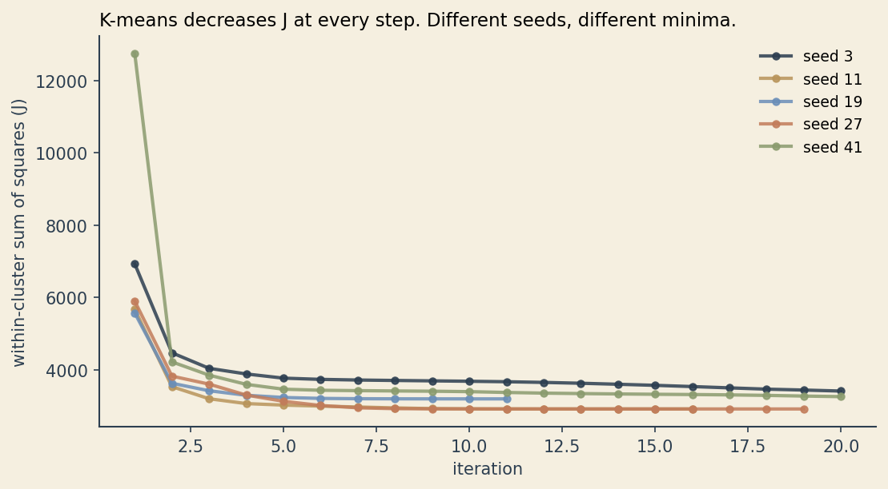
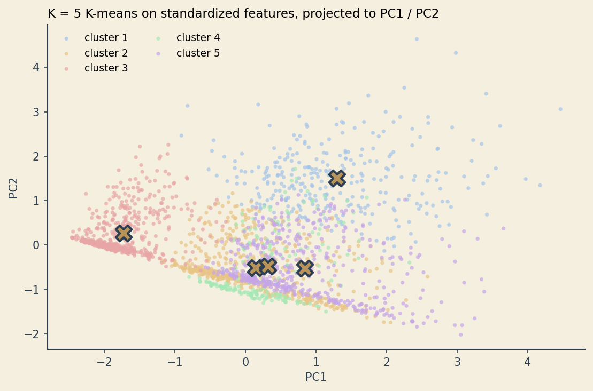
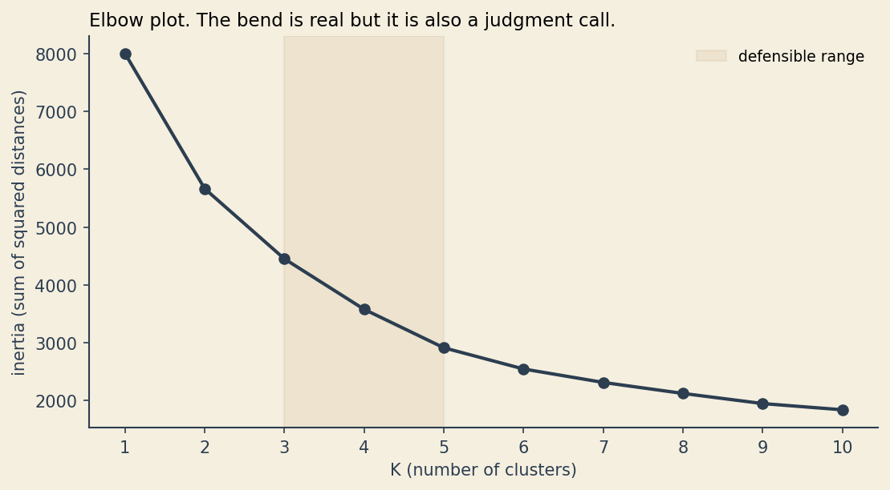
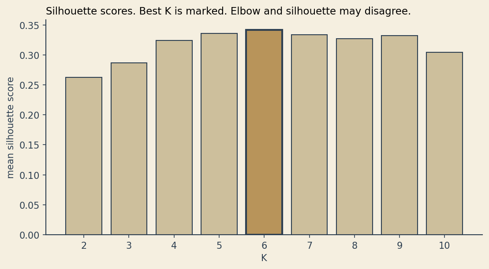
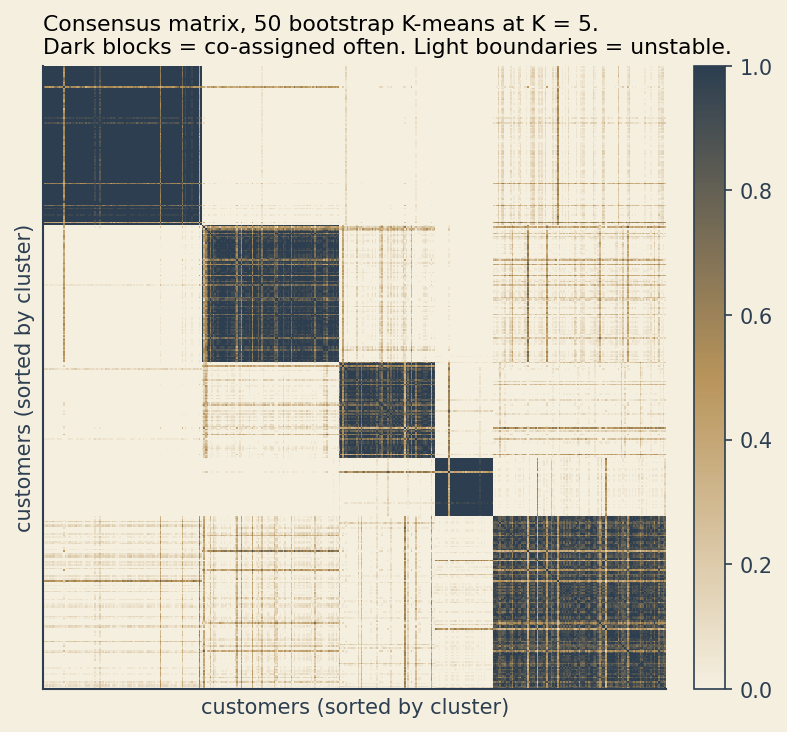
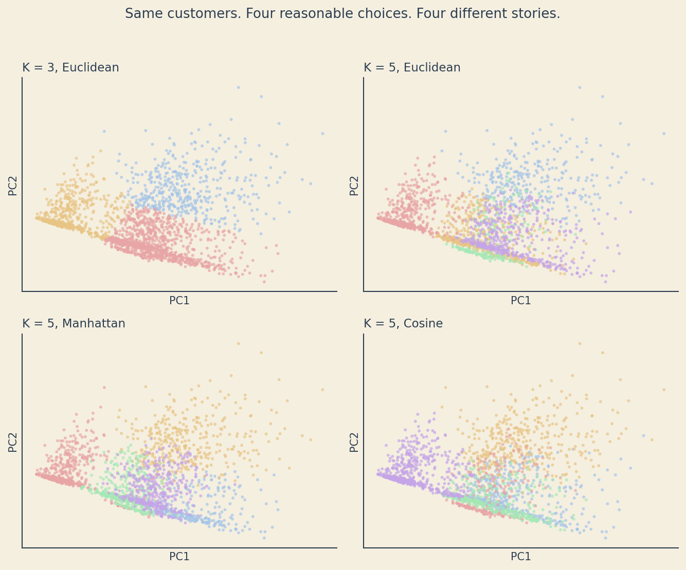
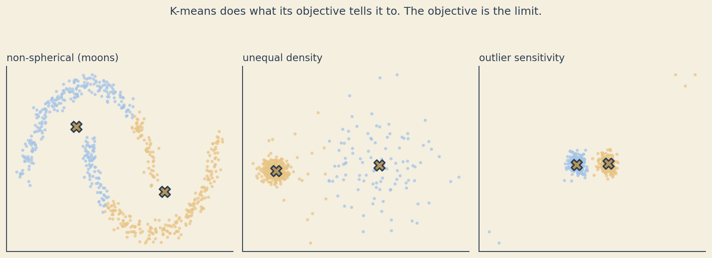

```{=html}
<script>
(function loadGSAP() {
  if (typeof gsap !== 'undefined') { document.dispatchEvent(new Event('gsap-ready')); return; }
  var savedDefine = window.define;
  window.define = undefined;
  var s1 = document.createElement('script');
  s1.src = 'https://cdnjs.cloudflare.com/ajax/libs/gsap/3.12.5/gsap.min.js';
  s1.onload = function() { window.define = savedDefine; document.dispatchEvent(new Event('gsap-ready')); };
  s1.onerror = function() { window.define = savedDefine; document.dispatchEvent(new Event('gsap-ready')); };
  document.head.appendChild(s1);
})();
</script>

<link href="https://fonts.googleapis.com/css2?family=Caveat:wght@500;700&display=swap" rel="stylesheet">

<link rel="preload" as="image" href="../../assets/clusters-beat-02-month-one.webp" type="image/webp">
<link rel="preload" as="image" href="../../assets/clusters-beat-03-the-brief.webp" type="image/webp">
<link rel="preload" as="image" href="../../assets/clusters-beat-04-she-didnt-know.webp" type="image/webp">

<style>
/* ===== Clusters story page (scoped) ===== */
.cl-intro { text-align:center; max-width:780px; margin:1.5rem auto 0; padding:0 1rem; }
.cl-intro p { font-family:'Playfair Display', Georgia, serif; font-style:italic; color:#2c3e50; font-size:1.1rem; line-height:1.6; margin:0; }

/* Floating skip-to-animation button (top of page) */
.cl-top-nav {
  display: flex; flex-wrap: wrap; gap: 8px;
  margin: 12px 0 0 12px;
}
.cl-skip-anim {
  display: inline-flex; align-items: center; gap: 6px;
  padding: 8px 14px;
  background: #2c3e50; color: #faf6ef; text-decoration: none;
  border-radius: 999px; font-family:'Source Sans 3', sans-serif;
  font-size: 0.85rem; font-weight: 500;
  box-shadow: 0 4px 12px rgba(44,62,80,0.18);
  border: 1px solid rgba(184,148,90,0.3);
  transition: transform 0.18s ease, background 0.18s ease;
}
.cl-skip-anim:hover { background:#1c2c3a; color:#faf6ef; transform: translateY(-1px); }
.cl-skip-deep { background: #b8945a; color: #2c3e50; }
.cl-skip-deep:hover { background:#a8854b; color:#2c3e50; }

/* Slideshow viewer */
.cl-viewer {
  position: relative;
  width: 100%;
  max-width: none;
  margin: 1.25rem auto 0;
  background: #faf6ef;
  border-radius: 14px;
  box-shadow: 0 10px 38px rgba(44,62,80,0.10);
  border: 1px solid rgba(44,62,80,0.08);
  padding: 12px 12px 0;
  overflow: visible;
  box-sizing: border-box;
}
.cl-viewer:fullscreen,
.cl-viewer:-webkit-full-screen {
  width: 100vw; height: 100vh; max-width: none; border-radius: 0;
  padding: 0; margin: 0;
  background: #faf6ef;
  overflow: hidden;
}
.cl-viewer-stage {
  position: relative;
  background: #faf6ef;
  border-radius: 10px;
  width: 100%;
  aspect-ratio: 16 / 9;
  display: flex; align-items: center; justify-content: center;
  overflow: visible;
}
.cl-slide {
  position: relative; width: 100%; height: 100%;
  display: flex; align-items: center; justify-content: center;
  transition: opacity 220ms ease-in-out;
  overflow: visible;
}
.cl-slide.fading { opacity: 0; }
.cl-slide picture {
  display: block; width: 100%; height: 100%;
}
.cl-panel-image, .cl-slide img {
  display: block;
  width: 100%;
  height: 100%;
  object-fit: contain;
}

/* Fullscreen: image fills screen aggressively, chrome overlays at bottom */
.cl-viewer:fullscreen .cl-viewer-stage,
.cl-viewer:-webkit-full-screen .cl-viewer-stage {
  aspect-ratio: auto;
  width: 100vw;
  height: 100vh;
  border-radius: 0;
  min-height: 0;
}
.cl-viewer:fullscreen .cl-panel-image,
.cl-viewer:fullscreen .cl-slide img,
.cl-viewer:-webkit-full-screen .cl-panel-image,
.cl-viewer:-webkit-full-screen .cl-slide img {
  width: 100vw;
  height: calc(100vh - 24px);
  object-fit: contain;
}
.cl-viewer:fullscreen .cl-notes-row,
.cl-viewer:-webkit-full-screen .cl-notes-row {
  position: absolute; left: 50%; bottom: 60px; transform: translateX(-50%);
  width: min(1100px, 96vw); margin: 0; z-index: 10;
  gap: 10px;
}
.cl-viewer:fullscreen .cl-notes-wrap,
.cl-viewer:-webkit-full-screen .cl-notes-wrap { flex: 1 1 auto; }
.cl-viewer:fullscreen .cl-notes,
.cl-viewer:-webkit-full-screen .cl-notes {
  background: rgba(44,62,80,0.78);
  color: #faf6ef;
  border-color: rgba(184,148,90,0.45);
  border-left-color: #b8945a;
  backdrop-filter: blur(8px);
  -webkit-backdrop-filter: blur(8px);
}
.cl-viewer:fullscreen .cl-notes-close,
.cl-viewer:-webkit-full-screen .cl-notes-close {
  color: #faf6ef; border-color: rgba(250,246,239,0.4);
}
.cl-viewer:fullscreen .cl-controls,
.cl-viewer:-webkit-full-screen .cl-controls {
  padding: 6px 10px; border-radius: 999px;
  background: rgba(250,246,239,0.92);
  backdrop-filter: blur(6px);
  -webkit-backdrop-filter: blur(6px);
  border: 1px solid rgba(44,62,80,0.15);
}
.cl-viewer:fullscreen .cl-sections,
.cl-viewer:-webkit-full-screen .cl-sections {
  position: absolute; left: 50%; bottom: 8px; transform: translateX(-50%);
  width: min(1100px, 96vw); margin: 0; padding: 4px 8px; border-top: 0;
  background: rgba(250,246,239,0.85);
  backdrop-filter: blur(6px);
  -webkit-backdrop-filter: blur(6px);
  border-radius: 999px;
  z-index: 10;
}
.cl-viewer:fullscreen .cl-progress,
.cl-viewer:-webkit-full-screen .cl-progress {
  position: absolute; left: 0; right: 0; bottom: 0; margin: 0; z-index: 10;
}

/* Fullscreen button */
.cl-fs-btn {
  position: absolute; top: 14px; right: 14px; z-index: 6;
  width: 38px; height: 38px; border-radius: 50%;
  background: rgba(44,62,80,0.85); color:#faf6ef;
  border: 1px solid rgba(184,148,90,0.4);
  display: inline-flex; align-items: center; justify-content: center;
  cursor: pointer; transition: background 0.18s ease, transform 0.18s ease;
}
.cl-fs-btn:hover { background:#2c3e50; transform: scale(1.05); }
.cl-fs-btn svg { display: block; }

/* "See it run live" overlay button for panel 13 */
.cl-runlive {
  position: absolute; right: 22px; bottom: 22px; z-index: 5;
  display: inline-flex; align-items: center; gap: 6px;
  padding: 9px 14px; border-radius: 999px;
  background: #b8945a; color: #2c3e50; text-decoration: none;
  font-family:'Source Sans 3', sans-serif; font-size: 0.9rem; font-weight: 600;
  box-shadow: 0 6px 16px rgba(184,148,90,0.35);
  border: 1px solid rgba(44,62,80,0.18);
  transition: transform 0.18s ease, background 0.18s ease;
}
.cl-runlive:hover { background:#a8854b; transform: translateY(-1px); color:#2c3e50; }

/* Notes + controls row (sits BELOW the image stage in normal flow) */
.cl-notes-row {
  display: flex; align-items: center; gap: 12px;
  margin: 16px 0 0;
  padding: 0;
  flex-wrap: wrap;
}
.cl-notes-wrap {
  flex: 1 1 320px;
  min-width: 0;
  position: relative;
}
.cl-notes {
  position: relative;
  background: #faf6ef;
  border: 1px solid rgba(44,62,80,0.15);
  border-left: 4px solid #b8945a;
  border-radius: 999px;
  padding: 12px 44px 12px 20px;
  font-family:'Source Sans 3', sans-serif;
  color: #2c3e50; font-size: 0.98rem; line-height: 1.5;
  box-shadow: 0 4px 12px rgba(44,62,80,0.06);
}
.cl-notes.hidden { display: none; }
.cl-notes-close {
  position: absolute; top: 50%; right: 12px; transform: translateY(-50%);
  width: 26px; height: 26px; border-radius: 50%;
  background: transparent; border: 1px solid rgba(44,62,80,0.25);
  color: #2c3e50; cursor: pointer;
  display: inline-flex; align-items: center; justify-content: center;
  font-size: 14px; line-height: 1;
}
.cl-notes-close:hover { background: rgba(44,62,80,0.08); }

/* Controls (live inside .cl-notes-row in windowed mode) */
.cl-controls {
  display: flex; align-items: center; justify-content: flex-end;
  gap: 8px; padding: 0; flex: 0 0 auto;
}
.cl-ctrl-btn {
  background: #faf6ef; color: #2c3e50;
  border: 1px solid rgba(44,62,80,0.2);
  padding: 7px 12px; border-radius: 8px;
  font-family:'Source Sans 3', sans-serif; font-size: 0.88rem;
  cursor: pointer; transition: background 0.15s ease, transform 0.15s ease;
  display: inline-flex; align-items: center; gap: 6px;
}
.cl-ctrl-btn:hover:not(:disabled) { background:#f0e9d8; }
.cl-ctrl-btn:disabled { opacity: 0.4; cursor: not-allowed; }
.cl-counter {
  font-family:'Source Sans 3', sans-serif; font-size: 0.88rem;
  color:#2c3e50; padding: 0 8px; min-width: 56px; text-align:center;
}
.cl-arrow { width:18px; height:18px; }

/* Section navigation bar */
.cl-sections {
  display: flex; flex-wrap: wrap; gap: 4px;
  padding: 10px 8px 12px; border-top: 1px solid rgba(44,62,80,0.08);
  margin: 0 -4px;
  justify-content: center;
}
.cl-section-btn {
  position: relative;
  background: transparent;
  border: 1px solid rgba(44,62,80,0.35);
  padding: 6px 14px; border-radius: 999px;
  font-family:'Source Sans 3', sans-serif; font-size: 0.78rem;
  cursor: pointer; transition: border-color 0.18s ease, box-shadow 0.18s ease;
  overflow: hidden;
  z-index: 0;
  line-height: 1.2;
}
.cl-section-btn:hover { background: rgba(44,62,80,0.06); }
.cl-section-fill {
  position: absolute;
  left: 0; top: 0; bottom: 0; width: 0%;
  background: #2c3e50;
  z-index: -1;
  transition: width 0.3s ease;
  pointer-events: none;
}
.cl-section-label {
  position: relative;
  z-index: 1;
  color: #2c3e50;
  white-space: nowrap;
  pointer-events: none;
}
.cl-section-btn.has-fill .cl-section-label,
.cl-section-btn.full-fill .cl-section-label { color: #f5efe0; }
.cl-section-btn.has-fill { border-color: #2c3e50; }
.cl-section-btn.active {
  border-color: #2c3e50;
  box-shadow: 0 3px 8px rgba(44,62,80,0.18);
}

/* Progress bar at the very bottom edge of the viewer */
.cl-progress {
  position: relative; height: 3px; background: rgba(44,62,80,0.08);
  margin: 0 -18px;
}
.cl-progress-fill {
  position: absolute; left: 0; top: 0; bottom: 0; width: 3%;
  background: linear-gradient(90deg, #2c3e50, #b8945a);
  transition: width 0.25s ease;
}

@media (max-width: 720px) {
  .cl-viewer { padding: 14px 12px 0; }
  .cl-notes { font-size: 0.92rem; padding: 10px 38px 10px 16px; }
  .cl-section-btn { font-size: 0.72rem; padding: 4px 9px; }
}

/* ============= K-MEANS WIDGET ============= */
.kl-widget {
  max-width: 1100px;
  margin: 3rem auto 2rem;
  background: #f5efe0;
  background-image:
    repeating-linear-gradient(135deg, rgba(244,226,133,0.18) 0 1px, transparent 1px 22px),
    repeating-linear-gradient(45deg, rgba(244,226,133,0.10) 0 1px, transparent 1px 22px);
  border: 1px solid rgba(44,62,80,0.12);
  border-radius: 14px;
  padding: 26px 26px 22px;
  position: relative;
  box-shadow: 0 10px 32px rgba(44,62,80,0.10);
  overflow: hidden;
}
.kl-widget::before, .kl-widget::after {
  content: ""; position: absolute; pointer-events: none;
  width: 60px; height: 60px;
  background-image: radial-gradient(circle at 30% 30%, rgba(44,62,80,0.35) 0 6px, transparent 7px),
                    radial-gradient(circle at 70% 50%, rgba(44,62,80,0.25) 0 4px, transparent 5px),
                    radial-gradient(circle at 50% 75%, rgba(44,62,80,0.20) 0 3px, transparent 4px);
  opacity: 0.6;
}
.kl-widget::before { top: 8px; left: 8px; transform: rotate(-15deg); }
.kl-widget::after  { bottom: 8px; right: 8px; transform: rotate(135deg); }
.kl-splatter {
  position: absolute; pointer-events: none; opacity: 0.5;
  width: 56px; height: 56px;
  background-image: radial-gradient(circle at 40% 50%, rgba(44,62,80,0.32) 0 5px, transparent 6px),
                    radial-gradient(circle at 70% 30%, rgba(44,62,80,0.20) 0 3px, transparent 4px);
  top: 14px; right: 22%; transform: rotate(25deg);
}

.kl-heading {
  font-family: 'Caveat', 'Kalam', cursive;
  font-weight: 700; font-size: 2.1rem; color: #2c3e50;
  margin: 0 0 6px; text-align: center; letter-spacing: 0.5px;
}
.kl-sub {
  font-family: 'Source Sans 3', sans-serif;
  color: #2c3e50; font-size: 0.98rem; line-height: 1.55;
  max-width: 640px; margin: 0 auto 18px; text-align: center;
}

.kl-chart-wrap {
  position: relative; margin: 12px auto 14px;
  max-width: 760px;
}
.kl-chart {
  width: 100%; height: auto; display: block;
  background: #faf6ef;
  border-radius: 6px;
}
.kl-axis-x, .kl-axis-y {
  font-family: 'Caveat', 'Kalam', cursive;
  font-size: 1.05rem; color: #2c3e50;
}
.kl-axis-x { text-align: center; margin-top: 6px; }
.kl-axis-y {
  position: absolute; left: -28px; top: 50%;
  transform: rotate(-90deg) translateX(50%); transform-origin: left top;
}

.kl-status {
  font-family: 'Caveat', 'Kalam', cursive;
  font-size: 1.25rem; color: #2c3e50; text-align: center;
  margin: 0 0 10px; min-height: 1.6em;
}
.kl-iter { font-family: 'Source Sans 3', sans-serif; font-size: 0.95rem; color: #2c3e50; }
.kl-iter strong { font-family: 'Caveat', cursive; font-size: 1.4rem; color: #b8945a; margin-left: 4px; }

.kl-controls {
  display: flex; flex-wrap: wrap; gap: 10px;
  justify-content: center; align-items: center;
  padding: 8px 0 4px;
}
.kl-btn {
  background: #2c3e50; color: #faf6ef;
  border: 1px solid rgba(184,148,90,0.4);
  padding: 8px 16px; border-radius: 8px;
  font-family:'Source Sans 3', sans-serif; font-size: 0.92rem; font-weight: 500;
  cursor: pointer; transition: transform 0.15s ease, background 0.15s ease;
}
.kl-btn:hover:not(:disabled) { background:#1c2c3a; transform: translateY(-1px); }
.kl-btn:disabled { opacity: 0.5; cursor: not-allowed; }
.kl-btn.ghost {
  background: #faf6ef; color: #2c3e50; border: 1px solid rgba(44,62,80,0.25);
}
.kl-btn.ghost:hover:not(:disabled) { background:#f0e9d8; }
.kl-btn.accent {
  background: #b8945a; color: #2c3e50;
}
.kl-btn.accent:hover:not(:disabled) { background:#a8854b; }

.kl-field {
  display: inline-flex; align-items: center; gap: 6px;
  font-family:'Source Sans 3', sans-serif; font-size: 0.9rem; color:#2c3e50;
}
.kl-field select, .kl-field input[type=range] {
  font-family:'Source Sans 3', sans-serif; font-size: 0.9rem;
  background: #faf6ef; color: #2c3e50;
  border: 1px solid rgba(44,62,80,0.25); border-radius: 6px;
  padding: 5px 8px;
}
.kl-field input[type=range] { padding: 0; width: 120px; }

.kl-status-row {
  display: flex; justify-content: space-between; align-items: center;
  max-width: 760px; margin: 0 auto;
  padding: 4px 4px 8px;
}

.kl-back {
  display: inline-flex; align-items: center; gap: 6px;
  margin: 18px 6px 0; padding: 8px 16px;
  background: #faf6ef; color: #2c3e50; text-decoration: none;
  border: 1px solid rgba(44,62,80,0.25); border-radius: 999px;
  font-family:'Source Sans 3', sans-serif; font-size: 0.88rem;
}
.kl-back:hover { background:#f0e9d8; color:#2c3e50; }
.kl-back-wrap { text-align: center; display: flex; flex-wrap: wrap; gap: 6px; justify-content: center; }
.kl-back-deep { background: #b8945a; color: #2c3e50; border-color: rgba(44,62,80,0.3); }
.kl-back-deep:hover { background:#a8854b; color:#2c3e50; }

/* Progress bar (top of chart) */
.kl-progress {
  position: relative; height: 5px; border-radius: 999px;
  background: #f5efe0; max-width: 760px; margin: 4px auto 8px;
  overflow: hidden; border: 1px solid rgba(44,62,80,0.12);
}
.kl-progress-fill {
  height: 100%; width: 0%;
  background: linear-gradient(90deg, #2c3e50, #b8945a);
  border-radius: 999px;
}

/* Fullscreen toggle button (icon-only, anchored top-right of widget) */
.kl-fs-btn { padding: 7px 10px; }
.kl-fs-btn svg { display: block; }
.kl-fs-corner {
  position: absolute; top: 12px; right: 12px; z-index: 20;
  width: 36px; height: 36px; padding: 0;
  border-radius: 50%;
  background: rgba(44,62,80,0.85); color: #faf6ef;
  border: 1px solid rgba(184,148,90,0.45);
  display: inline-flex; align-items: center; justify-content: center;
  cursor: pointer; transition: background 0.18s ease, transform 0.18s ease;
}
.kl-fs-corner:hover { background:#2c3e50; transform: scale(1.05); }

/* Running-commentary description card */
.kl-desc {
  max-width: 760px; margin: 12px auto 14px;
  background: #f8f3e3; color: #2c3e50;
  border: 1px solid rgba(184,148,90,0.3);
  border-radius: 8px;
  padding: 12px 16px;
  font-family: 'Source Sans 3', sans-serif;
  font-size: 14.5px; line-height: 1.55; font-style: italic;
  min-height: 1.6em;
}
.kl-desc-text {
  display: block; opacity: 1;
  transition: opacity 0.2s ease;
}
.kl-desc-text.fading { opacity: 0; }

/* Fullscreen styling for the widget */
.kl-widget:fullscreen,
.kl-widget:-webkit-full-screen {
  width: 100vw; height: 100vh; max-width: none; border-radius: 0;
  padding: 28px 36px; display: flex; flex-direction: column;
  background: #f5efe0; overflow: auto;
}
.kl-widget:fullscreen .kl-chart-wrap,
.kl-widget:-webkit-full-screen .kl-chart-wrap {
  flex: 1; min-height: 0; max-width: none; width: 100%;
  display: flex; align-items: center; justify-content: center;
}
.kl-widget:fullscreen .kl-chart,
.kl-widget:-webkit-full-screen .kl-chart {
  width: 100%; height: 100%; max-height: calc(100vh - 240px);
}
.kl-widget:fullscreen .kl-progress,
.kl-widget:-webkit-full-screen .kl-progress { max-width: 100%; }
.kl-widget:fullscreen .kl-status-row,
.kl-widget:-webkit-full-screen .kl-status-row { max-width: 100%; }
.kl-widget:fullscreen .kl-desc,
.kl-widget:-webkit-full-screen .kl-desc { max-width: 100%; margin: 10px 0 12px; }

@media (max-width: 720px) {
  .kl-widget { padding: 18px 14px 16px; }
  .kl-heading { font-size: 1.7rem; }
  .kl-controls { gap: 6px; }
  .kl-btn { padding: 6px 12px; font-size: 0.85rem; }
}

/* ============= "FOR THE CURIOUS" BLOG ============= */
.cl-blog {
  max-width: 720px;
  margin: 80px auto 0;
  padding: 0 1.25rem 2.5rem;
  color: #2c3e50;
  font-family: 'Source Sans 3', sans-serif;
  font-size: 17px; line-height: 1.7;
}
.cl-blog h2.cl-blog-title {
  font-family: 'Playfair Display', Georgia, serif;
  font-weight: 600; font-size: 2.1rem; margin: 0 0 8px;
  color: #2c3e50; letter-spacing: 0.2px;
}
.cl-blog .cl-blog-lede {
  font-family: 'Playfair Display', Georgia, serif;
  font-style: italic; font-size: 1.05rem; color: #4a5a6a;
  margin: 0 0 32px;
}
.cl-blog h3 {
  font-family: 'Playfair Display', Georgia, serif;
  font-weight: 600; font-size: 1.45rem; color: #2c3e50;
  margin: 44px 0 12px;
}
.cl-blog p { margin: 0 0 16px; }
.cl-blog ul { padding-left: 1.4rem; margin: 0 0 20px; }
.cl-blog ul li { margin-bottom: 8px; }
.cl-blog a { color: #b8945a; text-decoration: underline; }
.cl-blog a:hover { color: #8c6f3e; }
.cl-blog img {
  display: block; max-width: 100%; height: auto;
  border: 1px solid rgba(44,62,80,0.18); border-radius: 8px;
  margin: 24px 0;
  background: #faf6ef;
}
.cl-blog figure { margin: 24px 0; }
.cl-blog figcaption {
  font-size: 14px; color: #5a6470; font-style: italic;
  text-align: center; margin-top: 6px;
}
.cl-blog pre {
  background: #f8f3e3; color: #2c3e50;
  border-radius: 4px; padding: 16px;
  font-family: 'JetBrains Mono', Menlo, Consolas, monospace;
  font-size: 14px; line-height: 1.55;
  overflow-x: auto;
  border: 1px solid rgba(44,62,80,0.10);
}
.cl-blog code {
  background: rgba(184,148,90,0.12); color: #2c3e50;
  padding: 1px 6px; border-radius: 4px;
  font-family: 'JetBrains Mono', Menlo, Consolas, monospace;
  font-size: 0.94em;
}
.cl-blog pre code { background: transparent; padding: 0; font-size: 14px; }
.cl-blog .cl-blog-math {
  background: #faf6ef; border-left: 3px solid #b8945a;
  padding: 14px 18px; margin: 18px 0; border-radius: 4px;
  overflow-x: auto;
}
.cl-blog .cl-blog-back {
  display: inline-flex; align-items: center; gap: 6px;
  margin: 36px 0 0; padding: 9px 18px;
  background: #2c3e50; color: #faf6ef; text-decoration: none;
  border-radius: 999px; font-size: 0.92rem;
  border: 1px solid rgba(184,148,90,0.3);
}
.cl-blog .cl-blog-back:hover { background:#1c2c3a; color: #faf6ef; }
</style>

<div class="cl-top-nav">
  <a href="#kmeans-widget" class="cl-skip-anim" id="cl-skip-top">Skip to animation &darr;</a>
  <a href="#cl-blog" class="cl-skip-anim cl-skip-deep" id="cl-skip-deep">&darr; Technical deep dive</a>
</div>

<div class="cl-intro">
  <p>An honest story about what cluster analysis is, how it works, and where it lies.</p>
</div>

<div class="cl-viewer" id="cl-viewer">
  <button class="cl-fs-btn" id="cl-fs" aria-label="Toggle fullscreen" title="Fullscreen (F)">
    <svg width="18" height="18" viewBox="0 0 24 24" fill="none" stroke="currentColor" stroke-width="2" stroke-linecap="round" stroke-linejoin="round">
      <path d="M3 9V3h6"></path>
      <path d="M21 9V3h-6"></path>
      <path d="M3 15v6h6"></path>
      <path d="M21 15v6h-6"></path>
    </svg>
  </button>
  <div class="cl-viewer-stage" id="cl-stage">
    <div style="text-align:center;padding:40px;color:#5a5a5a;font-style:italic;">Loading story&hellip;</div>
  </div>

  <div class="cl-notes-row" id="cl-notes-row">
    <div class="cl-notes-wrap">
      <div class="cl-notes" id="cl-notes">
        <span id="cl-notes-text"></span>
        <button class="cl-notes-close" id="cl-notes-close" aria-label="Hide notes" title="Hide notes">&times;</button>
      </div>
    </div>
    <div class="cl-controls">
      <button class="cl-ctrl-btn" id="cl-notes-toggle" title="Toggle notes (N)">Hide notes</button>
      <button class="cl-ctrl-btn" id="cl-prev" disabled aria-label="Previous slide">
        <svg class="cl-arrow" viewBox="0 0 24 24" fill="none" stroke="currentColor" stroke-width="2" stroke-linecap="round" stroke-linejoin="round"><polyline points="15 18 9 12 15 6"></polyline></svg>
      </button>
      <span class="cl-counter" id="cl-counter">1 / 29</span>
      <button class="cl-ctrl-btn" id="cl-next" aria-label="Next slide">
        <svg class="cl-arrow" viewBox="0 0 24 24" fill="none" stroke="currentColor" stroke-width="2" stroke-linecap="round" stroke-linejoin="round"><polyline points="9 18 15 12 9 6"></polyline></svg>
      </button>
    </div>
  </div>

  <div class="cl-sections" id="cl-sections"></div>

  <div class="cl-progress"><div class="cl-progress-fill" id="cl-progress"></div></div>
</div>

<script>
function initClustersTheater() {
  var hasGsap = typeof gsap !== 'undefined';
  var viewer = document.getElementById('cl-viewer');
  var stage = document.getElementById('cl-stage');
  var notesEl = document.getElementById('cl-notes');
  var notesText = document.getElementById('cl-notes-text');
  var notesCloseBtn = document.getElementById('cl-notes-close');
  var notesToggle = document.getElementById('cl-notes-toggle');
  var prevBtn = document.getElementById('cl-prev');
  var nextBtn = document.getElementById('cl-next');
  var counterEl = document.getElementById('cl-counter');
  var sectionsBar = document.getElementById('cl-sections');
  var progressEl = document.getElementById('cl-progress');
  var fsBtn = document.getElementById('cl-fs');
  var current = 0;
  var notesVisible = true;
  var preloaded = {};
  var base = '../../assets/';

  var panels = [
    { webp: 'clusters-beat-02-month-one.webp', png: 'clusters-beat-02-month-one.png', section: 'Setup',
      note: "Lina just joined a streaming service as a junior analyst on the Customer Insights team. She has no idea what she's about to be asked." },
    { webp: 'clusters-beat-03-the-brief.webp', png: 'clusters-beat-03-the-brief.png', section: 'Setup',
      note: 'Her manager hands her a big task. Lina nods confidently. She is not sure what she just agreed to.' },
    { webp: 'clusters-beat-04-she-didnt-know.webp', png: 'clusters-beat-04-she-didnt-know.png', section: 'Setup',
      note: 'She had never done cluster analysis. She had heard of it. She did not know what it actually did.' },
    { webp: 'clusters-beat-05-the-plan.webp', png: 'clusters-beat-05-the-plan.png', section: 'Setup',
      note: 'She gave herself two weeks. She started at zero.' },
    { webp: 'clusters-beat-06-customer-as-dot.webp', png: 'clusters-beat-06-customer-as-dot.png', section: 'Intuition',
      note: 'The first thing the book asked her to picture: turn every customer into a single dot. Where they sit in space depends on what you measure about them.' },
    { webp: 'clusters-beat-07-eight-million-dots.webp', png: 'clusters-beat-07-eight-million-dots.png', section: 'Intuition',
      note: 'She sketched it out. Each axis is a feature she measures. With two features, every customer is a dot in two dimensions. She could see the groups.' },
    { webp: 'clusters-beat-08-more-dimensions.webp', png: 'clusters-beat-08-more-dimensions.png', section: 'Intuition',
      note: "If she measures three things about each customer, the dots live in 3D. Four things, 4D. She can't visualize 4D. Neither can anyone. This is why we need an algorithm." },
    { webp: 'clusters-beat-09-drop-centers.webp', png: 'clusters-beat-09-drop-centers.png', section: 'Intuition',
      note: 'K-means starts with you picking how many groups you want, then dropping that many centers into the data at random. Three is a guess. K is a choice.' },
    { webp: 'clusters-beat-10-assign-dots.webp', png: 'clusters-beat-10-assign-dots.png', section: 'Intuition',
      note: 'Every dot looks around and picks the center closest to it. Three groups form.' },
    { webp: 'clusters-beat-11-move-centers.webp', png: 'clusters-beat-11-move-centers.png', section: 'Intuition',
      note: 'Each center moves to the middle of its assigned group. The groups have moved a little. The centers have moved with them.' },
    { webp: 'clusters-beat-12-repeat.webp', png: 'clusters-beat-12-repeat.png', section: 'Intuition',
      note: 'She reassigns every dot, moves the centers again, and repeats. Each round changes a little less than the last.' },
    { webp: 'clusters-beat-13-settle.webp', png: 'clusters-beat-13-settle.png', section: 'Intuition',
      note: 'Eventually the centers stop moving. The algorithm has found its clusters. She had just hand drawn K-means.', runlive: true },
    { webp: 'clusters-beat-14-field-guide.webp', png: 'clusters-beat-14-field-guide.png', section: 'Vocabulary',
      note: 'She had just seen K-means. Now she needed to learn what professionals call it.' },
    { webp: 'clusters-beat-15-k-and-centroids.webp', png: 'clusters-beat-15-k-and-centroids.png', section: 'Vocabulary',
      note: 'K is the number of clusters. The centers are called centroids. That is the whole vocabulary, in two words.' },
    { webp: 'clusters-beat-16-features-dimensions.webp', png: 'clusters-beat-16-features-dimensions.png', section: 'Vocabulary',
      note: 'The things you measure about each customer are called features. Each feature adds a dimension. More features means more dimensions.' },
    { webp: 'clusters-beat-17-distance.webp', png: 'clusters-beat-17-distance.png', section: 'Vocabulary',
      note: "The algorithm needs to know what 'close' means. There are different ways to measure it. The most common is Euclidean, the ruler distance. Different choices give different clusters." },
    { webp: 'clusters-beat-18-the-build.webp', png: 'clusters-beat-18-the-build.png', section: 'The Build',
      note: 'Two weeks later she ran her first real clustering. K equals five. Five features. She had a Python script that worked. She had personas.' },
    { webp: 'clusters-beat-19-presentation.webp', png: 'clusters-beat-19-presentation.png', section: 'The Build',
      note: 'She presented five personas. Marketing loved them. They built five email campaigns around the five segments.' },
    { webp: 'clusters-beat-20-honeymoon.webp', png: 'clusters-beat-20-honeymoon.png', section: 'The Build',
      note: 'Early metrics looked great. Open rates were up. Lina got a Slack message that called her a wizard. She kept it pinned.' },
    { webp: 'clusters-beat-21-part-two-divider.webp', png: 'clusters-beat-21-part-two-divider.png', section: 'Part 2',
      note: "And that's how Lina learned the algorithm. But the math was the easy part." },
    { webp: 'clusters-beat-22-the-complaint.webp', png: 'clusters-beat-22-the-complaint.png', section: 'The Trap',
      note: 'Then a complaint came in. Sofia, an eight year premium subscriber, had received a discount email meant for the Deal Hunter segment. Sofia was not a Deal Hunter. The clusters had put her there anyway.' },
    { webp: 'clusters-beat-23-different-personas.webp', png: 'clusters-beat-23-different-personas.png', section: 'The Trap',
      note: 'She re-ran the clustering on fresh data, just to validate. The personas came out completely different. The same customers were now in different groups. Marketing had been chasing ghosts.' },
    { webp: 'clusters-beat-24-different-k.webp', png: 'clusters-beat-24-different-k.png', section: 'The Trap',
      note: 'Out of curiosity, she ran K-means with K=3, then K=8. Each gave a completely different set of personas. The data did not change. The story did.' },
    { webp: 'clusters-beat-25-four-choices.webp', png: 'clusters-beat-25-four-choices.png', section: 'The Trap',
      note: 'She had made four choices: K, features, distance metric, and timing. She had presented all four as if they were facts. They had been guesses.' },
    { webp: 'clusters-beat-26-the-book.webp', png: 'clusters-beat-26-the-book.png', section: 'The Mentor',
      note: "Her manager did not blame her. She handed her a book. 'Read chapter four,' she said. 'Then come back.'" },
    { webp: 'clusters-beat-27-useful-fictions.webp', png: 'clusters-beat-27-useful-fictions.png', section: 'The Mentor',
      note: 'The book put it plainly. Cluster analysis does not discover types of customers that exist in nature. It builds a way of organizing customers based on the choices the analyst makes. The clusters are useful fictions, not natural facts.' },
    { webp: 'clusters-beat-28-the-fix.webp', png: 'clusters-beat-28-the-fix.png', section: 'Discipline',
      note: 'Her next clustering project came with a different attitude. She tested multiple K values. She validated stability with bootstrap samples. She defended every choice. The personas were labeled as constructions, not discoveries.' },
    { webp: 'clusters-beat-29-the-habit.webp', png: 'clusters-beat-29-the-habit.png', section: 'Discipline',
      note: 'Months later, the work was different. So was Lina. She pinned a sticky note above her monitor that she never took down.' },
    { webp: 'clusters-beat-30-the-closing.webp', png: 'clusters-beat-30-the-closing.png', section: 'Closing',
      note: 'And that is what she learned.' }
  ];

  var sectionOrder = ['Setup','Intuition','Vocabulary','The Build','Part 2','The Trap','The Mentor','Discipline','Closing'];
  var sectionFirstIndex = {};
  var sectionCount = {};
  sectionOrder.forEach(function(name) {
    sectionCount[name] = 0;
    for (var i = 0; i < panels.length; i++) {
      if (panels[i].section === name) {
        if (sectionFirstIndex[name] === undefined) sectionFirstIndex[name] = i;
        sectionCount[name] += 1;
      }
    }
  });

  // Build section nav bar with a progressive fill inside each pill
  var sectionFills = {};
  sectionOrder.forEach(function(name) {
    var btn = document.createElement('button');
    btn.className = 'cl-section-btn';
    btn.dataset.section = name;
    var fill = document.createElement('span');
    fill.className = 'cl-section-fill';
    fill.style.width = '0%';
    var label = document.createElement('span');
    label.className = 'cl-section-label';
    label.textContent = name;
    btn.appendChild(fill);
    btn.appendChild(label);
    btn.addEventListener('click', function() {
      if (typeof sectionFirstIndex[name] === 'number') goTo(sectionFirstIndex[name]);
    });
    sectionsBar.appendChild(btn);
    sectionFills[name] = { btn: btn, fill: fill };
  });

  function preload(i) {
    if (i < 0 || i >= panels.length) return;
    if (preloaded[i]) return;
    var img = new Image();
    img.src = base + panels[i].webp;
    preloaded[i] = img;
  }

  function renderScene(n) {
    var p = panels[n];
    var loading = (n === 0) ? 'eager' : 'lazy';
    var extra = p.runlive
      ? '<a href="#kmeans-widget" class="cl-runlive" id="cl-runlive">See it run live &darr;</a>'
      : '';
    stage.innerHTML =
      '<div class="cl-slide" id="cl-slide-img">' +
        '<picture class="cl-panel-image">' +
          '<source srcset="' + base + p.webp + '" type="image/webp">' +
          '' +
        '</picture>' +
        extra +
      '</div>';
    if (hasGsap) {
      gsap.fromTo(stage.querySelector('.cl-slide'),
        { opacity: 0 }, { opacity: 1, duration: 0.35, ease: 'power2.out' });
    }
  }

  function updateSectionsActive() {
    var current_section = panels[current].section;
    sectionOrder.forEach(function(name) {
      var ref = sectionFills[name];
      if (!ref) return;
      var first = sectionFirstIndex[name];
      var total = sectionCount[name] || 1;
      var pct;
      if (current < first) {
        pct = 0;
      } else if (current >= first + total) {
        pct = 100;
      } else {
        pct = ((current - first + 1) / total) * 100;
      }
      if (hasGsap) {
        gsap.to(ref.fill, { width: pct + '%', duration: 0.3, ease: 'power2.out' });
      } else {
        ref.fill.style.width = pct + '%';
      }
      ref.btn.classList.toggle('active', name === current_section);
      ref.btn.classList.toggle('has-fill', pct > 0);
      ref.btn.classList.toggle('full-fill', pct >= 100);
    });
  }

  function goTo(n) {
    if (n < 0 || n >= panels.length) return;
    var prevSlide = stage.querySelector('.cl-slide');
    var commit = function() {
      current = n;
      renderScene(n);
      notesText.textContent = panels[n].note;
      counterEl.textContent = (n + 1) + ' / ' + panels.length;
      prevBtn.disabled = (n === 0);
      nextBtn.disabled = (n === panels.length - 1);
      progressEl.style.width = (((n + 1) / panels.length) * 100) + '%';
      updateSectionsActive();
      preload(n + 1); preload(n + 2);
    };
    if (!prevSlide) { commit(); return; }
    prevSlide.classList.add('fading');
    setTimeout(commit, 200);
  }

  prevBtn.addEventListener('click', function() { goTo(current - 1); });
  nextBtn.addEventListener('click', function() { goTo(current + 1); });

  function setNotesVisible(v) {
    notesVisible = v;
    if (v) {
      notesEl.classList.remove('hidden');
      notesToggle.textContent = 'Hide notes';
    } else {
      notesEl.classList.add('hidden');
      notesToggle.textContent = 'Show notes';
    }
  }
  notesCloseBtn.addEventListener('click', function() { setNotesVisible(false); });
  notesToggle.addEventListener('click', function() { setNotesVisible(!notesVisible); });

  function isFullscreen() {
    return document.fullscreenElement === viewer || document.webkitFullscreenElement === viewer;
  }
  function toggleFullscreen() {
    if (isFullscreen()) {
      if (document.exitFullscreen) document.exitFullscreen();
      else if (document.webkitExitFullscreen) document.webkitExitFullscreen();
    } else {
      if (viewer.requestFullscreen) viewer.requestFullscreen();
      else if (viewer.webkitRequestFullscreen) viewer.webkitRequestFullscreen();
    }
  }
  fsBtn.addEventListener('click', toggleFullscreen);

  document.addEventListener('keydown', function(e) {
    var rect = viewer.getBoundingClientRect();
    var inView = rect.top < window.innerHeight && rect.bottom > 0;
    if (!inView && !isFullscreen()) return;
    if (e.key === 'ArrowRight') { goTo(current + 1); e.preventDefault(); }
    else if (e.key === 'ArrowLeft') { goTo(current - 1); e.preventDefault(); }
    else if (e.key === 'n' || e.key === 'N') { setNotesVisible(!notesVisible); e.preventDefault(); }
    else if (e.key === 'f' || e.key === 'F') { toggleFullscreen(); e.preventDefault(); }
  });

  preload(0); preload(1); preload(2);
  goTo(0);
}
if (typeof gsap !== 'undefined') { initClustersTheater(); }
else { document.addEventListener('gsap-ready', initClustersTheater); }
</script>
```

```{=html}
<div class="kl-widget" id="kmeans-widget">
  <button class="kl-fs-btn kl-fs-corner" id="kl-fs" aria-label="Toggle fullscreen" title="Fullscreen (F)">
    <svg width="16" height="16" viewBox="0 0 24 24" fill="none" stroke="currentColor" stroke-width="2" stroke-linecap="round" stroke-linejoin="round" aria-hidden="true">
      <path d="M3 9V3h6"></path>
      <path d="M21 9V3h-6"></path>
      <path d="M3 15v6h6"></path>
      <path d="M21 15v6h-6"></path>
    </svg>
  </button>
  <span class="kl-splatter"></span>
  <h2 class="kl-heading">See K-means run live</h2>
  <p class="kl-sub">This is the algorithm you just read about. Click Start to watch it run. Use Step to walk through it one move at a time. Change K to see how different choices give different stories.</p>

  <div class="kl-status-row">
    <div class="kl-status" id="kl-status">Ready</div>
    <div class="kl-iter">Iteration:<strong id="kl-iter">0</strong></div>
  </div>

  <div class="kl-progress" aria-hidden="true"><div class="kl-progress-fill" id="kl-progress-fill"></div></div>

  <div class="kl-chart-wrap">
    <svg class="kl-chart" id="kl-chart" viewBox="0 0 720 460" preserveAspectRatio="xMidYMid meet" role="img" aria-label="K-means scatter plot">
      <defs>
        <pattern id="kl-grid" width="40" height="40" patternUnits="userSpaceOnUse">
          <path d="M 40 0 L 0 0 0 40" fill="none" stroke="#f4e285" stroke-width="0.6" opacity="0.6"/>
        </pattern>
        <filter id="kl-rough" x="-10%" y="-10%" width="120%" height="120%">
          <feTurbulence type="fractalNoise" baseFrequency="0.02" numOctaves="2" seed="3"/>
          <feDisplacementMap in="SourceGraphic" scale="1.6"/>
        </filter>
      </defs>
      <rect x="0" y="0" width="720" height="460" fill="#faf6ef"/>
      <rect x="20" y="20" width="680" height="420" fill="url(#kl-grid)"/>
      <rect x="20" y="20" width="680" height="420" fill="none" stroke="#2c3e50" stroke-width="1.6" filter="url(#kl-rough)" opacity="0.85"/>
      <text x="360" y="455" text-anchor="middle" class="kl-axis-x" fill="#2c3e50" font-family="Caveat, Kalam, cursive" font-size="18">watch time</text>
      <text x="10" y="230" text-anchor="middle" transform="rotate(-90 10 230)" fill="#2c3e50" font-family="Caveat, Kalam, cursive" font-size="18">spend</text>
      <g id="kl-lines"></g>
      <g id="kl-dots"></g>
      <g id="kl-centroids"></g>
      <g id="kl-stars"></g>
    </svg>
  </div>

  <div class="kl-desc" id="kl-desc" role="status" aria-live="polite">
    <span class="kl-desc-text" id="kl-desc-text">This is K-means in action. Click Start to watch the algorithm find clusters in the dots below. Try changing K to see how the same data tells different stories.</span>
  </div>

  <div class="kl-controls">
    <button class="kl-btn" id="kl-start">Start</button>
    <button class="kl-btn ghost" id="kl-step">Step</button>
    <button class="kl-btn accent" id="kl-reset">Reset</button>
    <label class="kl-field">K =
      <select id="kl-k">
        <option>2</option><option>3</option><option selected>4</option><option>5</option>
        <option>6</option><option>7</option><option>8</option>
      </select>
    </label>
    <label class="kl-field">Speed
      <input type="range" id="kl-speed" min="0.3" max="2.2" step="0.1" value="1">
    </label>
  </div>

  <div class="kl-back-wrap">
    <a href="#cl-skip-top" class="kl-back" id="kl-back">&uarr; Back to story</a>
    <a href="#cl-blog" class="kl-back kl-back-deep" id="kl-go-deep">&darr; Want more? Read the technical deep dive</a>
  </div>
</div>

<script>
function initKmeansWidget() {
  var hasGsap = typeof gsap !== 'undefined';
  var widget = document.getElementById('kmeans-widget');
  var svg = document.getElementById('kl-chart');
  var dotsG = document.getElementById('kl-dots');
  var centroidsG = document.getElementById('kl-centroids');
  var linesG = document.getElementById('kl-lines');
  var starsG = document.getElementById('kl-stars');
  var statusEl = document.getElementById('kl-status');
  var iterEl = document.getElementById('kl-iter');
  var startBtn = document.getElementById('kl-start');
  var stepBtn = document.getElementById('kl-step');
  var resetBtn = document.getElementById('kl-reset');
  var kSel = document.getElementById('kl-k');
  var speedInput = document.getElementById('kl-speed');
  var fsBtn = document.getElementById('kl-fs');
  var progressFill = document.getElementById('kl-progress-fill');
  var descTextEl = document.getElementById('kl-desc-text');
  var EXPECTED_ITERS = 10;
  var lastDescKey = '';
  var DESC = {
    initial:    'This is K-means in action. Click Start to watch the algorithm find clusters in the dots below. Try changing K to see how the same data tells different stories.',
    dropped:    'K centroids dropped at random positions. The algorithm will now refine them step by step.',
    assigning:  function(iter) {
      var prefix = iter > 0 ? ('Iteration ' + (iter + 1) + '. ') : '';
      return prefix + 'Step 1: each dot looks at all centroids and picks the closest one. Dots are now colored by their assigned cluster.';
    },
    updating:   function(iter) {
      var prefix = iter > 0 ? ('Iteration ' + (iter + 1) + '. ') : '';
      return prefix + 'Step 2: each centroid moves to the center of its assigned dots. The new position is the average of the group.';
    },
    repeating:  'Repeating: reassign dots, then move centroids. Each round, the moves get smaller.',
    converged:  function(iter) {
      return 'Converged in ' + iter + ' iteration' + (iter === 1 ? '' : 's') + '. The centroids have stopped moving. The algorithm has found its clusters.';
    }
  };
  function setDesc(key, payload) {
    var text;
    if (typeof DESC[key] === 'function') text = DESC[key](payload);
    else text = DESC[key];
    if (!text || !descTextEl) return;
    if (text === lastDescKey || descTextEl.textContent === text) {
      lastDescKey = text;
      return;
    }
    lastDescKey = text;
    descTextEl.classList.add('fading');
    setTimeout(function() {
      descTextEl.textContent = text;
      descTextEl.classList.remove('fading');
    }, 200);
  }

  function setProgressPct(pct) {
    var p = Math.max(0, Math.min(100, pct));
    if (hasGsap) {
      gsap.to(progressFill, { width: p + '%', duration: 0.45, ease: 'power2.out' });
    } else {
      progressFill.style.width = p + '%';
    }
  }
  function progressForIter(n, isConverged) {
    if (isConverged) return 100;
    var raw = (n / EXPECTED_ITERS) * 100;
    return Math.min(raw, 95);
  }

  var SVG_NS = 'http://www.w3.org/2000/svg';
  var W = 720, H = 460;
  var PADX = 50, PADY = 50;
  var XMIN = PADX, XMAX = W - PADX, YMIN = PADY, YMAX = H - PADY;

  var palette = ['#a5c5e8','#e8c585','#e8a5a5','#a5e8b5','#c5a5e8','#7cc4c2','#c27c5a','#b8dce8'];
  var dots = [];
  var centroids = [];
  var iteration = 0;
  var running = false;
  var stepPhase = 'assign'; // 'assign' or 'move'
  var converged = false;

  function speed() { return parseFloat(speedInput.value) || 1; }
  function dur(ms) { return (ms / 1000) / speed(); }

  function rand(a, b) { return a + Math.random() * (b - a); }

  function generateDots() {
    // 3-4 natural cluster blobs to make the demo readable
    var n = 84;
    var blobs = 3 + Math.floor(Math.random() * 2);
    var centersBlob = [];
    for (var b = 0; b < blobs; b++) {
      centersBlob.push({
        x: rand(XMIN + 60, XMAX - 60),
        y: rand(YMIN + 60, YMAX - 60),
        spread: rand(28, 50)
      });
    }
    var pts = [];
    for (var i = 0; i < n; i++) {
      var bi = i % blobs;
      var c = centersBlob[bi];
      var ang = Math.random() * Math.PI * 2;
      var rad = Math.abs(randGauss()) * c.spread;
      pts.push({
        x: Math.max(XMIN + 6, Math.min(XMAX - 6, c.x + Math.cos(ang) * rad)),
        y: Math.max(YMIN + 6, Math.min(YMAX - 6, c.y + Math.sin(ang) * rad)),
        cluster: -1
      });
    }
    return pts;
  }
  function randGauss() {
    var u = 1 - Math.random(), v = Math.random();
    return Math.sqrt(-2 * Math.log(u)) * Math.cos(2 * Math.PI * v);
  }

  function generateCentroids(k) {
    var arr = [];
    for (var i = 0; i < k; i++) {
      arr.push({
        x: rand(XMIN + 40, XMAX - 40),
        y: rand(YMIN + 40, YMAX - 40),
        targetX: 0, targetY: 0,
        color: palette[i % palette.length]
      });
    }
    return arr;
  }

  function renderDots(initial) {
    dotsG.innerHTML = '';
    dots.forEach(function(d, i) {
      var c = document.createElementNS(SVG_NS, 'circle');
      c.setAttribute('cx', d.x); c.setAttribute('cy', d.y);
      c.setAttribute('r', 5.4);
      c.setAttribute('fill', '#cdbf9c');
      c.setAttribute('opacity', '0.85');
      c.setAttribute('stroke', 'rgba(44,62,80,0.35)');
      c.setAttribute('stroke-width', '0.8');
      c.dataset.idx = i;
      dotsG.appendChild(c);
    });
  }

  function renderCentroids(dropIn) {
    centroidsG.innerHTML = '';
    centroids.forEach(function(c, i) {
      var g = document.createElementNS(SVG_NS, 'g');
      g.setAttribute('class', 'kl-centroid');
      g.dataset.idx = i;
      var size = 10;
      var x1 = document.createElementNS(SVG_NS, 'line');
      x1.setAttribute('x1', -size); x1.setAttribute('y1', -size);
      x1.setAttribute('x2', size);  x1.setAttribute('y2', size);
      x1.setAttribute('stroke', '#b8945a'); x1.setAttribute('stroke-width', '3.2'); x1.setAttribute('stroke-linecap', 'round');
      var x2 = document.createElementNS(SVG_NS, 'line');
      x2.setAttribute('x1', -size); x2.setAttribute('y1', size);
      x2.setAttribute('x2', size);  x2.setAttribute('y2', -size);
      x2.setAttribute('stroke', '#b8945a'); x2.setAttribute('stroke-width', '3.2'); x2.setAttribute('stroke-linecap', 'round');
      var ring = document.createElementNS(SVG_NS, 'circle');
      ring.setAttribute('r', 13); ring.setAttribute('fill', 'rgba(184,148,90,0.12)');
      ring.setAttribute('stroke', c.color); ring.setAttribute('stroke-width', '1.4');
      g.appendChild(ring); g.appendChild(x1); g.appendChild(x2);
      g.setAttribute('transform', 'translate(' + c.x + ',' + (dropIn ? -30 : c.y) + ')');
      centroidsG.appendChild(g);
      if (dropIn && hasGsap) {
        gsap.to(g, {
          attr: { transform: 'translate(' + c.x + ',' + c.y + ')' },
          duration: dur(700),
          ease: 'bounce.out',
          delay: i * 0.08
        });
      } else {
        g.setAttribute('transform', 'translate(' + c.x + ',' + c.y + ')');
      }
    });
  }

  function nearestCentroid(d) {
    var best = 0, bestDist = Infinity;
    for (var i = 0; i < centroids.length; i++) {
      var dx = d.x - centroids[i].x, dy = d.y - centroids[i].y;
      var dist = dx * dx + dy * dy;
      if (dist < bestDist) { bestDist = dist; best = i; }
    }
    return best;
  }

  function drawAssignmentLines(callback) {
    linesG.innerHTML = '';
    dots.forEach(function(d) {
      var c = centroids[nearestCentroid(d)];
      var line = document.createElementNS(SVG_NS, 'line');
      line.setAttribute('x1', d.x); line.setAttribute('y1', d.y);
      line.setAttribute('x2', d.x); line.setAttribute('y2', d.y);
      line.setAttribute('stroke', '#2c3e50');
      line.setAttribute('stroke-width', '0.6');
      line.setAttribute('opacity', '0.45');
      linesG.appendChild(line);
      if (hasGsap) {
        gsap.to(line, { attr: { x2: c.x, y2: c.y }, duration: dur(300), ease: 'power1.out' });
      } else {
        line.setAttribute('x2', c.x); line.setAttribute('y2', c.y);
      }
    });
    setTimeout(callback || function(){}, 300 / speed());
  }

  function recolorDots() {
    var circles = dotsG.querySelectorAll('circle');
    dots.forEach(function(d, i) {
      var ci = nearestCentroid(d);
      d.cluster = ci;
      var color = centroids[ci].color;
      if (hasGsap) {
        gsap.to(circles[i], { attr: { fill: color }, duration: dur(300), ease: 'power1.out' });
      } else {
        circles[i].setAttribute('fill', color);
      }
    });
  }

  function fadeLines(callback) {
    var lines = linesG.querySelectorAll('line');
    if (!lines.length) { callback && callback(); return; }
    if (hasGsap) {
      gsap.to(lines, { attr: { opacity: 0 }, duration: dur(200), onComplete: function() {
        linesG.innerHTML = ''; callback && callback();
      }});
    } else {
      linesG.innerHTML = '';
      callback && callback();
    }
  }

  function moveCentroidsToMean(callback) {
    var sums = centroids.map(function() { return { x: 0, y: 0, n: 0 }; });
    dots.forEach(function(d) {
      if (d.cluster < 0) return;
      sums[d.cluster].x += d.x; sums[d.cluster].y += d.y; sums[d.cluster].n += 1;
    });
    var maxMove = 0;
    var nodes = centroidsG.querySelectorAll('g.kl-centroid');
    centroids.forEach(function(c, i) {
      var s = sums[i];
      var nx = s.n > 0 ? s.x / s.n : c.x;
      var ny = s.n > 0 ? s.y / s.n : c.y;
      var dx = nx - c.x, dy = ny - c.y;
      var mv = Math.sqrt(dx*dx + dy*dy);
      if (mv > maxMove) maxMove = mv;
      c.x = nx; c.y = ny;
      if (hasGsap) {
        gsap.to(nodes[i], {
          attr: { transform: 'translate(' + nx + ',' + ny + ')' },
          duration: dur(500),
          ease: 'power2.inOut'
        });
      } else {
        nodes[i].setAttribute('transform', 'translate(' + nx + ',' + ny + ')');
      }
    });
    setTimeout(function() { callback && callback(maxMove); }, 500 / speed());
  }

  function setStatus(text) { statusEl.textContent = text; }
  function setIter(n) { iterEl.textContent = n; }

  function spawnConvergedStars() {
    starsG.innerHTML = '';
    centroids.forEach(function(c, i) {
      var star = document.createElementNS(SVG_NS, 'text');
      star.setAttribute('x', c.x + 16);
      star.setAttribute('y', c.y - 12);
      star.setAttribute('fill', '#b8945a');
      star.setAttribute('font-size', '20');
      star.setAttribute('text-anchor', 'middle');
      star.textContent = '★';
      star.setAttribute('opacity', '0');
      starsG.appendChild(star);
      if (hasGsap) {
        gsap.to(star, { attr: { opacity: 1 }, duration: dur(300), delay: i * 0.08 });
        gsap.fromTo(star, { attr: { 'font-size': 6 } }, { attr: { 'font-size': 20 }, duration: dur(400), delay: i * 0.08, ease: 'back.out(2)' });
      } else {
        star.setAttribute('opacity', '1');
      }
    });
  }

  function runOneIteration(callback) {
    setStatus('Assigning dots…');
    setDesc('assigning', iteration);
    drawAssignmentLines(function() {
      recolorDots();
      setTimeout(function() {
        fadeLines(function() {
          setStatus('Moving centroids…');
          setDesc('updating', iteration);
          moveCentroidsToMean(function(maxMove) {
            iteration += 1; setIter(iteration);
            if (maxMove < 1.2 || iteration >= 30) {
              converged = true;
              setStatus('Converged!');
              setDesc('converged', iteration);
              spawnConvergedStars();
              setProgressPct(100);
              running = false;
              callback && callback(true);
            } else {
              setProgressPct(progressForIter(iteration, false));
              setDesc('repeating');
              callback && callback(false);
            }
          });
        });
      }, 320 / speed());
    });
  }

  function runAll() {
    if (converged || running) return;
    running = true; startBtn.disabled = true; stepBtn.disabled = true;
    function loop() {
      runOneIteration(function(done) {
        if (done) {
          startBtn.disabled = false; stepBtn.disabled = false;
          return;
        }
        if (running) setTimeout(loop, 200 / speed());
        else { startBtn.disabled = false; stepBtn.disabled = false; }
      });
    }
    loop();
  }

  function doStep() {
    if (converged) return;
    if (stepPhase === 'assign') {
      setStatus('Assigning dots…');
      setDesc('assigning', iteration);
      drawAssignmentLines(function() {
        recolorDots();
        stepPhase = 'move';
      });
    } else {
      setStatus('Moving centroids…');
      setDesc('updating', iteration);
      fadeLines(function() {
        moveCentroidsToMean(function(maxMove) {
          iteration += 1; setIter(iteration);
          if (maxMove < 1.2 || iteration >= 30) {
            converged = true; setStatus('Converged!');
            setDesc('converged', iteration);
            spawnConvergedStars();
            setProgressPct(100);
          } else {
            setStatus('Ready');
            setDesc('repeating');
            setProgressPct(progressForIter(iteration, false));
          }
          stepPhase = 'assign';
        });
      });
    }
  }

  function reset(dropIn) {
    running = false; converged = false; iteration = 0; stepPhase = 'assign';
    starsG.innerHTML = ''; linesG.innerHTML = '';
    setIter(0); setStatus('Ready');
    setProgressPct(0);
    startBtn.disabled = false; stepBtn.disabled = false;
    var k = parseInt(kSel.value, 10) || 4;
    dots = generateDots();
    centroids = generateCentroids(k);
    renderDots(true);
    renderCentroids(dropIn !== false);
    lastDescKey = '';
    if (dropIn !== false) setDesc('initial');
    else setDesc('dropped');
  }

  function isWidgetFullscreen() {
    return document.fullscreenElement === widget || document.webkitFullscreenElement === widget;
  }
  function toggleWidgetFullscreen() {
    if (isWidgetFullscreen()) {
      if (document.exitFullscreen) document.exitFullscreen();
      else if (document.webkitExitFullscreen) document.webkitExitFullscreen();
    } else {
      if (widget.requestFullscreen) widget.requestFullscreen();
      else if (widget.webkitRequestFullscreen) widget.webkitRequestFullscreen();
    }
  }
  fsBtn.addEventListener('click', toggleWidgetFullscreen);

  document.addEventListener('keydown', function(e) {
    if (e.key !== 'f' && e.key !== 'F') return;
    // If the slideshow viewer is visible, let it handle F (it's higher on the page).
    var viewer = document.getElementById('cl-viewer');
    if (viewer) {
      var vr = viewer.getBoundingClientRect();
      var viewerInView = vr.top < window.innerHeight && vr.bottom > 0;
      if (viewerInView) return;
    }
    var wr = widget.getBoundingClientRect();
    var widgetInView = wr.top < window.innerHeight && wr.bottom > 0;
    if (!widgetInView && !isWidgetFullscreen()) return;
    toggleWidgetFullscreen();
    e.preventDefault();
  });

  startBtn.addEventListener('click', function() {
    if (converged) reset(false);
    runAll();
  });
  stepBtn.addEventListener('click', function() {
    if (converged) reset(false);
    doStep();
  });
  resetBtn.addEventListener('click', function() { reset(true); });
  kSel.addEventListener('change', function() { reset(true); });

  reset(true);
}
if (typeof gsap !== 'undefined') { initKmeansWidget(); }
else { document.addEventListener('gsap-ready', initKmeansWidget); }
</script>
```

::: {.cl-blog #cl-blog}

## For the curious {.cl-blog-title}

[The story above is the human version. This section is the technical version. Read whichever serves you. If you came for the math, this is where it lives.]{.cl-blog-lede}

### The objective function

K-means optimizes one quantity. For data points $x_1, \ldots, x_N$ and $K$ centroids $\mu_1, \ldots, \mu_K$, with $z_{ik} = 1$ when point $i$ is assigned to cluster $k$ and $0$ otherwise:

$$J = \sum_{i=1}^{N} \sum_{k=1}^{K} z_{ik} \, \lVert x_i - \mu_k \rVert^2$$

The algorithm alternates between two steps. Fix the centroids, then choose each $z_{ik}$ to minimize $J$ (assign every point to its nearest centroid). Fix the assignments, then choose each $\mu_k$ to minimize $J$ (set every centroid to the mean of its assigned points). Each step is guaranteed to either lower $J$ or keep it the same. The process is guaranteed to converge.

It is not guaranteed to converge to the lowest possible $J$. K-means finds a local minimum that depends on where the centroids were initialized. Two reasonable people running K-means on the same data with different random seeds can land on different clusterings, both locally optimal.

This is the formal mirror of the four choices Lina was making implicitly: $K$ (how many centroids), the features in $x$ (which dimensions to measure), the norm in $\lVert \cdot \rVert$ (which distance metric), and the slice of data she sampled (which time window). Change any of these and you change $J$, and you can change which local minimum the algorithm finds.



### A worked example

Synthetic streaming-service customers. Four features per customer: weekly watch hours, genre variety, monthly spend, and number of devices. Five underlying groups generated with different means and spreads. Two thousand customers in total.

```python
import numpy as np
import pandas as pd
from sklearn.cluster import KMeans
from sklearn.preprocessing import StandardScaler
from sklearn.decomposition import PCA

# X is a (2000, 4) array of watch_hours, genre_variety, monthly_spend, device_count
X = StandardScaler().fit_transform(X)
km = KMeans(n_clusters=5, n_init=10, random_state=7)
labels = km.fit_predict(X)

# project to 2D so we can see what the algorithm did
pca = PCA(n_components=2).fit(X)
XY = pca.transform(X)
centroids_xy = pca.transform(km.cluster_centers_)
```

Standardizing matters. Without it, `monthly_spend` (range roughly 0 to 60) would dominate `device_count` (range 1 to 5) purely because of unit choice. Standardization puts every feature on the same scale so the Euclidean distance treats them as equally important. This is itself a choice.



### The elbow method

Run K-means for $K = 1, 2, \ldots, 10$. Plot $J$ at the converged solution against $K$. As $K$ increases, $J$ has to decrease (more centroids means each point is on average closer to one of them). What you are looking for is a "bend" where adding another cluster stops buying you much.

In textbook plots the elbow is obvious. In real data it is almost always ambiguous. The chart below shows the elbow for the synthetic dataset. There is a defensible argument for $K = 3$, $K = 4$, or $K = 5$.



### Silhouette scores

The silhouette score for a point compares its average distance to the points in its own cluster against its average distance to the points in the nearest other cluster. The result is in $[-1, +1]$. Positive values say the point is closer to its own cluster than to any other. Negative values say it would be better off elsewhere. The mean silhouette across all points gives one number per choice of $K$.

Silhouette and elbow can disagree, and often do. When they do, you have to choose what you are optimizing for, and write that decision down.



### Stability via bootstrap

This is the test that would have saved Lina in the story above.

Resample the data with replacement. Run K-means on the bootstrap sample. Record, for every pair of customers, whether they ended up in the same cluster. Do this fifty times. For each pair, the fraction of bootstrap runs in which they were co-assigned is their consensus score.

If the clusters are real structure in the data, customers should be co-assigned almost every time. If the clusters are an artifact of sampling noise, the consensus matrix will be fuzzy.

Sort the matrix by a reference clustering and look at the result. Sharp dark blocks on the diagonal say the clusters are stable. Pale boundaries between blocks say the algorithm is uncertain where to draw the line.



If you only run one clustering and report the personas, you have no idea whether they are real or whether you would have invented different personas given a different draw of the data.

### Same data, four stories

The most uncomfortable plot in this post. Same 2000 customers, four reasonable analytical choices, four different clusterings.



Each of these clusterings could be defended. None of them is wrong. They are different answers to slightly different questions. The marketing team that builds five segments off the K = 5 Euclidean plot will tell a different story than the team that builds three segments off K = 3.

### Where K-means breaks

K-means is doing exactly what its objective tells it to do. The objective just does not match what we want from a clustering in every situation.



The crescent-moons example is famous. K-means assumes clusters are roughly spherical and roughly equally sized in feature space. Crescents are neither, so K-means cuts each moon in half along the boundary that minimizes $J$. The unequal-density example shows the same problem from a different angle: when one true cluster is much tighter than another, K-means tends to split the dense cluster and merge the sparse one to balance variance. The outlier example shows what happens when a few extreme points pull centroids away from where the mass of the data lives.

None of these are bugs. K-means is optimizing $J$. The complaint is that $J$ is not the thing we wanted.

### Alternatives

**DBSCAN.** Density-based clustering. Finds clusters as connected regions of high density, marks low-density points as noise. Handles arbitrary cluster shapes and is robust to outliers. The choices move from $K$ to two new parameters: a neighborhood radius and a minimum number of points to count as a dense region. Different choices, still choices.

**Hierarchical clustering.** Builds a tree of nested groupings. You can cut the tree at any level to get any number of clusters, and you can see how clusters merge as you relax the threshold. The choices move to the linkage rule (single, complete, average, Ward) and the cut height. The tree itself is a useful artifact even if you never commit to one cut.

**Gaussian mixture models.** Each cluster is a Gaussian distribution with its own mean and covariance, so clusters can be elongated, rotated, or differently sized. Fit by expectation-maximization. The choices move to $K$, the covariance structure (full, diagonal, tied), and the assumption that the components really are Gaussian. The model also gives every point a soft probability of belonging to each cluster rather than a hard label.

Switching algorithms does not eliminate the problem from the story above. It moves the choices around. You still have to defend them in writing.

### A defensible practice

A checklist that survives most clustering projects.

- Standardize features before clustering, or have a written reason not to.
- Try multiple $K$ values. Show both elbow and silhouette plots. Note where they agree and where they do not.
- Run K-means with multiple random initializations (`n_init = 10` or higher). Report the best result and a sense of the variance across initializations.
- Bootstrap the data, run the clustering many times, and look at the consensus matrix. Report stability alongside the clustering.
- Label the output as constructions, not discoveries. The personas exist because you built them. They do not exist in the data without you.
- Defend every choice in writing. If you cannot defend a choice, change it or document why you made it anyway.

### Further reading

- Hastie, T., Tibshirani, R., and Friedman, J. *The Elements of Statistical Learning*, Chapter 14 (Unsupervised Learning). The standard graduate-level reference.
- Aggarwal, C. C. (ed.) *Data Clustering: Algorithms and Applications*. A broader survey of clustering methods, including density-based and graph-based approaches.
- Monti, S. et al. (2003). "Consensus Clustering: A Resampling-Based Method for Class Discovery and Visualization of Gene Expression Microarray Data." The original paper on the bootstrap-stability approach used above.
- Hennig, C. (2015). "What are the true clusters?" *Pattern Recognition Letters*, 64. The most honest paper on this question. Worth reading twice.

The code that generated these charts lives in the notebooks folder of the [portfolio repo](https://github.com/rsm-msaad/merna-saad.github.io/tree/main/notebooks).

<a href="#cl-skip-top" class="cl-blog-back">&uarr; Back to top</a>

:::
