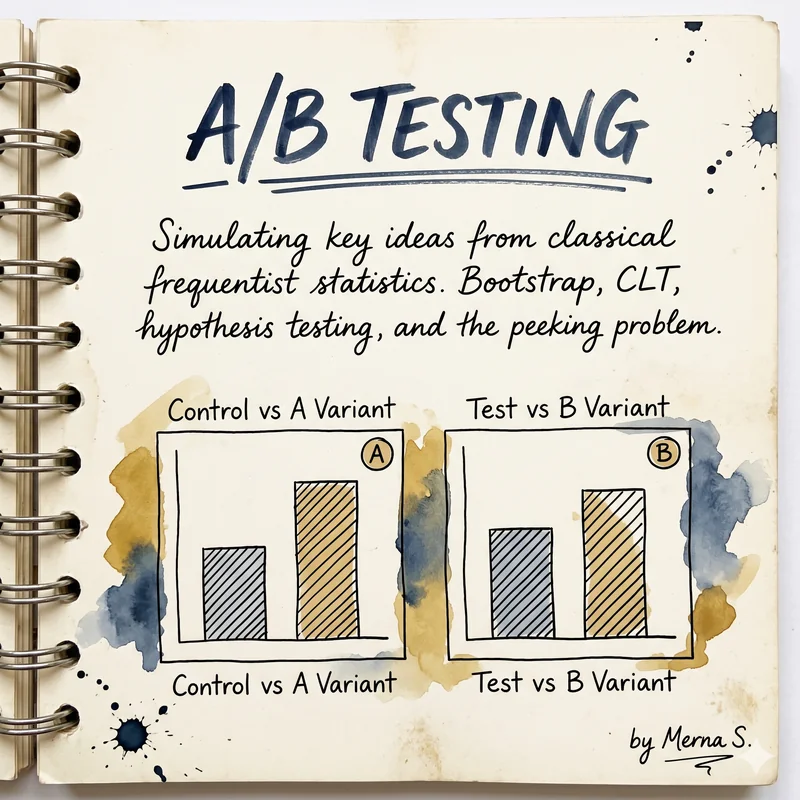
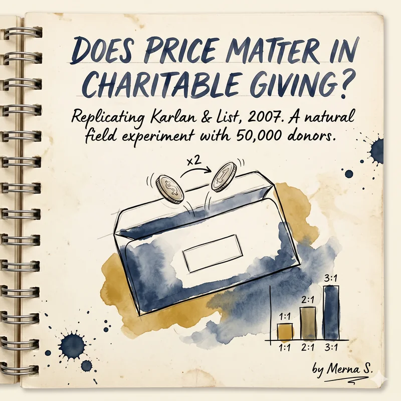
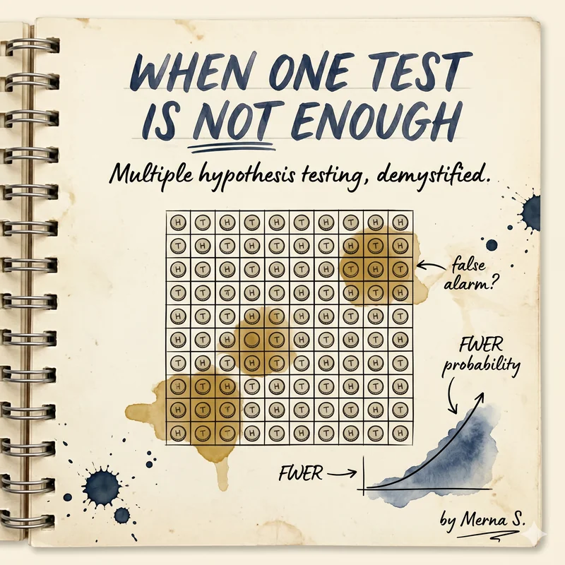

```{=html}
<div style="display: grid; grid-template-columns: repeat(auto-fill, minmax(260px, 1fr)); gap: 24px; padding: 20px 0; max-width: 900px;">
  <a href="claude-universe/" style="display: block; max-width: 300px; border-radius: 14px; overflow: hidden; box-shadow: 0 4px 14px rgba(44,62,80,0.08); transition: transform 0.3s ease; text-decoration: none;">
    
  </a>
  <a href="ab-testing/" style="display: block; max-width: 300px; border-radius: 14px; overflow: hidden; box-shadow: 0 4px 14px rgba(44,62,80,0.08); transition: transform 0.3s ease; text-decoration: none;">
    
  </a>
  <a href="charitable-giving/" style="display: block; max-width: 300px; border-radius: 14px; overflow: hidden; box-shadow: 0 4px 14px rgba(44,62,80,0.08); transition: transform 0.3s ease; text-decoration: none;">
    
  </a>
  <a href="multiple-testing/" style="display: block; max-width: 300px; border-radius: 14px; overflow: hidden; box-shadow: 0 4px 14px rgba(44,62,80,0.08); transition: transform 0.3s ease; text-decoration: none;">
    
  </a>
</div>
```
