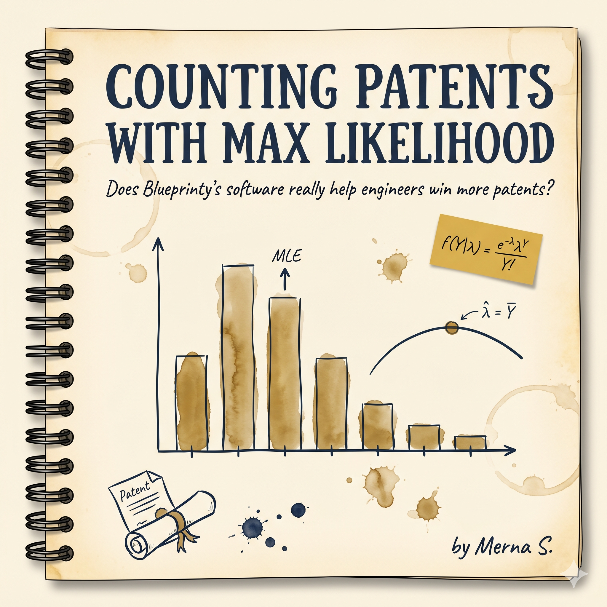
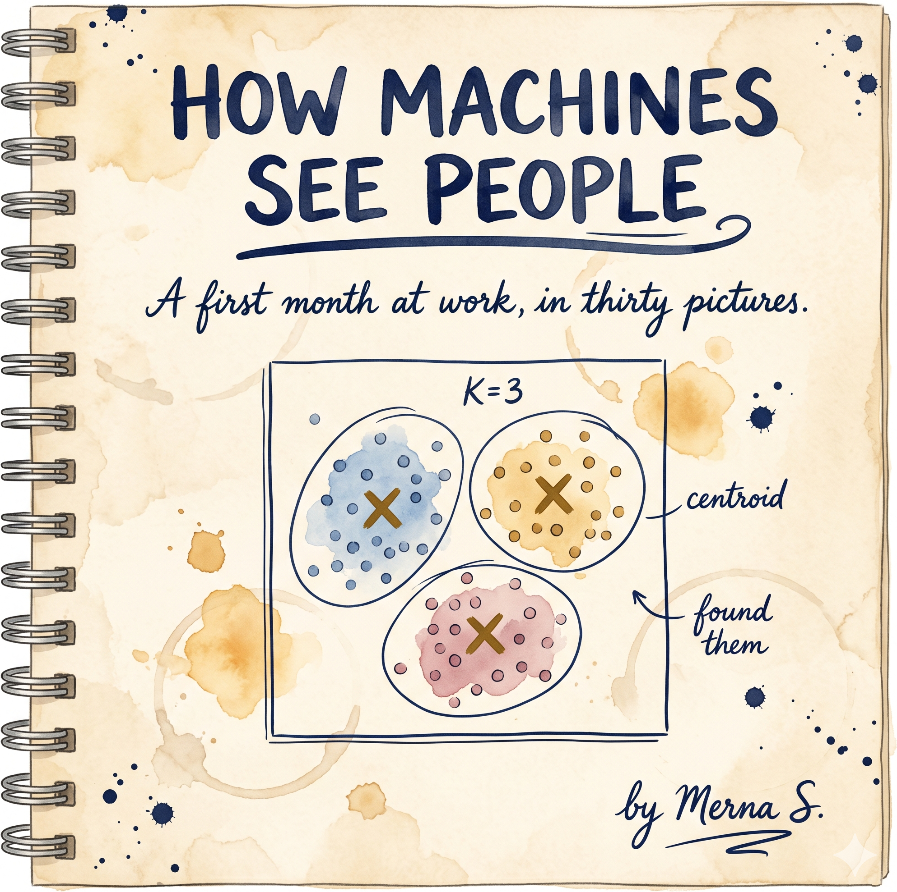
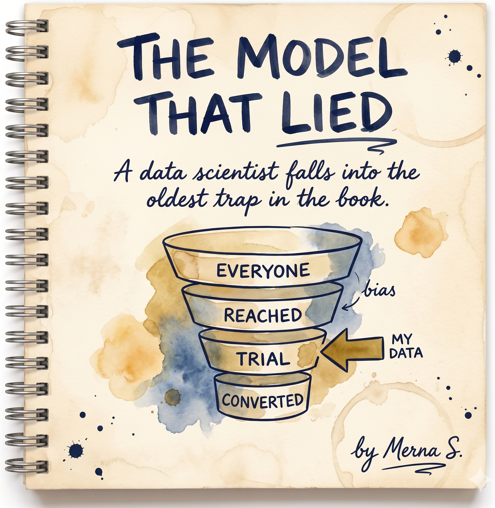
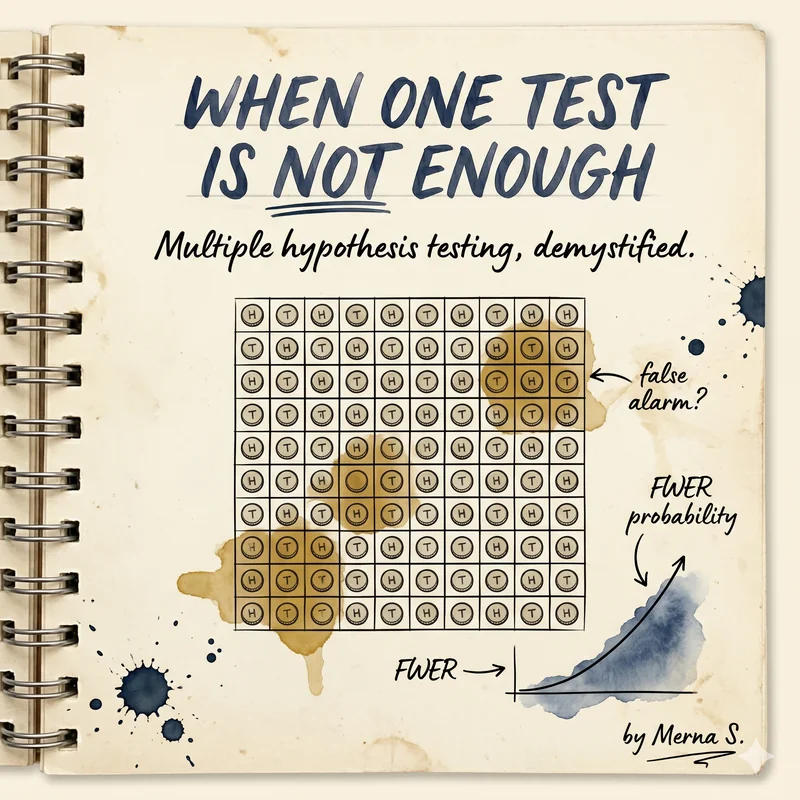
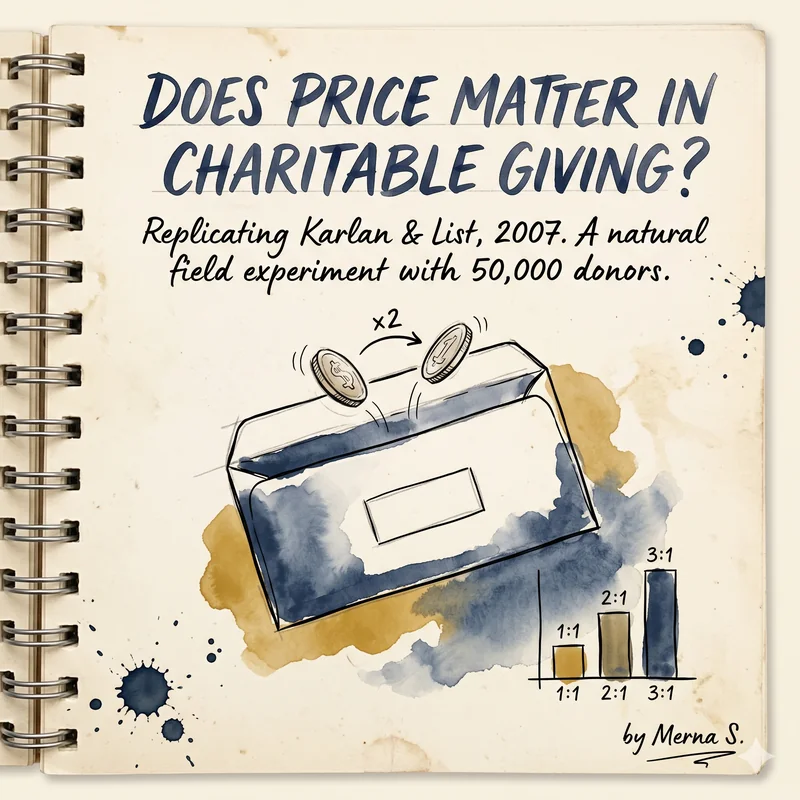
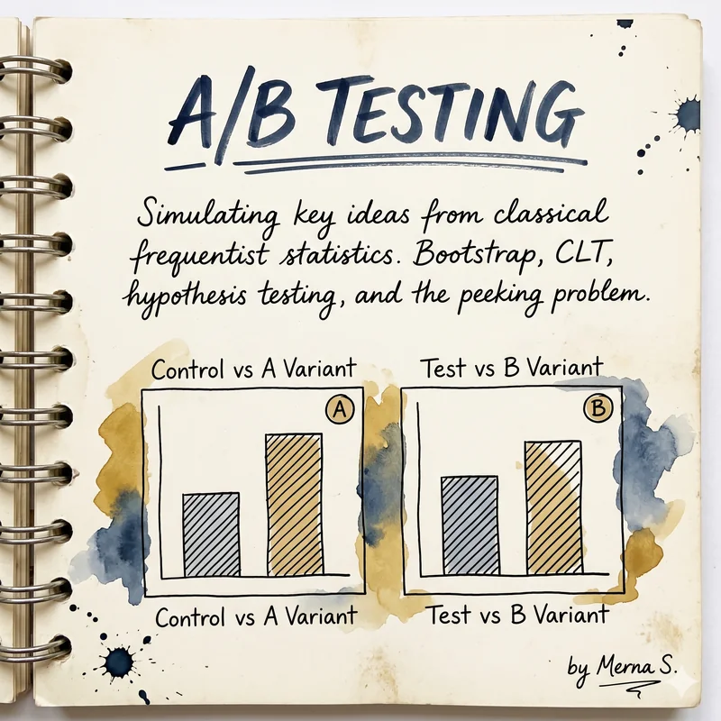

```{=html}
<style>
  .projects-grid {
    display: grid;
    grid-template-columns: repeat(3, 1fr);
    align-items: start;
    gap: 28px;
    padding: 20px 0;
    max-width: 1240px;
  }
  .projects-grid > a {
    max-width: none !important;
    background: transparent !important;
    display: block;
    line-height: 0;
  }
  .projects-grid > a picture,
  .projects-grid > a img {
    display: block;
    width: 100%;
    height: auto;
  }
  @media (max-width: 980px) {
    .projects-grid { grid-template-columns: repeat(2, 1fr); max-width: 820px; }
  }
  @media (max-width: 560px) {
    .projects-grid { grid-template-columns: 1fr; max-width: 420px; }
  }
</style>
<div class="projects-grid">
  <a href="maxdiff/" style="display: block; max-width: 300px; border-radius: 14px; overflow: hidden; box-shadow: 0 4px 14px rgba(44,62,80,0.08); transition: transform 0.3s ease; text-decoration: none;" title="Which MSBA Classes Do We Love? MaxDiff and MNL, three ways">
    
  </a>
  <a href="poisson-mle/" style="display: block; max-width: 300px; border-radius: 14px; overflow: hidden; box-shadow: 0 4px 14px rgba(44,62,80,0.08); transition: transform 0.3s ease; text-decoration: none;" title="Counting Patents with Maximum Likelihood">
    <picture>
      <source srcset="../assets/poisson-mle-cover.webp" type="image/webp">
      
    </picture>
  </a>
  <a href="clusters/" style="display: block; max-width: 300px; border-radius: 14px; overflow: hidden; box-shadow: 0 4px 14px rgba(44,62,80,0.08); transition: transform 0.3s ease; text-decoration: none;" title="How Machines See People">
    <picture>
      <source srcset="../assets/clusters-cover.webp" type="image/webp">
      
    </picture>
  </a>
  <a href="selection-bias/" style="display: block; max-width: 300px; border-radius: 14px; overflow: hidden; box-shadow: 0 4px 14px rgba(44,62,80,0.08); transition: transform 0.3s ease; text-decoration: none;">
    <picture>
      <source srcset="../assets/selection_bias_cover.webp" type="image/webp">
      
    </picture>
  </a>
  <a href="multiple-testing/" style="display: block; max-width: 300px; border-radius: 14px; overflow: hidden; box-shadow: 0 4px 14px rgba(44,62,80,0.08); transition: transform 0.3s ease; text-decoration: none;">
    
  </a>
  <a href="charitable-giving/" style="display: block; max-width: 300px; border-radius: 14px; overflow: hidden; box-shadow: 0 4px 14px rgba(44,62,80,0.08); transition: transform 0.3s ease; text-decoration: none;">
    
  </a>
  <a href="ab-testing/" style="display: block; max-width: 300px; border-radius: 14px; overflow: hidden; box-shadow: 0 4px 14px rgba(44,62,80,0.08); transition: transform 0.3s ease; text-decoration: none;">
    
  </a>
</div>
```
