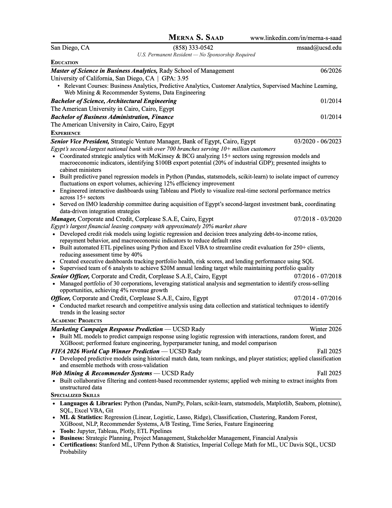

```{=html}
<style>#title-block-header { display: none !important; }</style>
<div class="resume-page">

  <!-- Top Row: Identity + Buttons -->
  <div class="resume-top-row">
    <div class="resume-identity">
      
      <div class="resume-name-block">
        <h1>Merna S. Saad</h1>
        <p class="resume-subtitle">MSBA candidate, UCSD Rady</p>
      </div>
    </div>
    <div class="resume-actions">
      <a href="https://mail.google.com/mail/?view=cm&fs=1&to=msaad@ucsd.edu" target="_blank" rel="noopener" class="about-link">
        <i class="bi bi-envelope"></i>
        <span class="about-link-text">Email</span>
      </a>
      <a href="https://www.linkedin.com/in/merna-s-saad" target="_blank" rel="noopener" class="about-link">
        <i class="bi bi-linkedin"></i>
        <span class="about-link-text">LinkedIn</span>
      </a>
      <a href="https://github.com/merna-saad" target="_blank" rel="noopener" class="about-link">
        <i class="bi bi-github"></i>
        <span class="about-link-text">GitHub</span>
      </a>
      <a href="../assets/Resume.pdf" download class="about-link about-link-primary">
        <i class="bi bi-download"></i>
        <span class="about-link-text">Download PDF</span>
      </a>
    </div>
  </div>

  <!-- Contact -->
  <div class="resume-contact">
    <span>San Diego, CA</span>
  </div>
  <div class="resume-visa">U.S. Permanent Resident, No Sponsorship Required</div>

  <hr class="resume-rule" />

  <!-- Resume Image -->
  <p class="resume-preview-hint">Click to download</p>
  <a href="../assets/Resume.pdf" download class="resume-preview-link" aria-label="Download resume PDF">
    
  </a>

</div>
```
